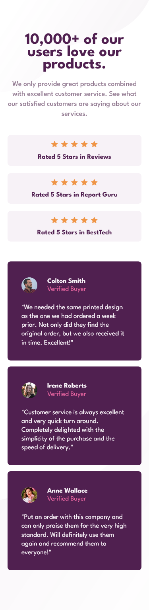
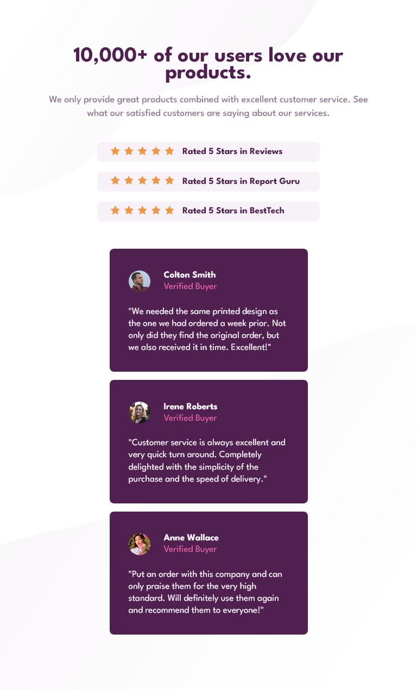
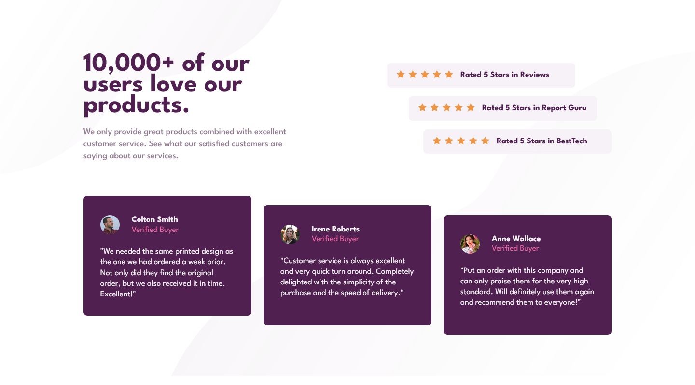

# Frontend Mentor - Social proof section solution

This is a solution to the [Social proof section challenge on Frontend Mentor](https://www.frontendmentor.io/challenges/social-proof-section-6e0qTv_bA). Frontend Mentor challenges help you improve your coding skills by building realistic projects. 

## Table of contents

- [Overview](#overview)
  - [The challenge](#the-challenge)
  - [Screenshot](#screenshot)
  - [Links](#links)
- [My process](#my-process)
  - [Built with](#built-with)
- [Author](#author)

## Overview

### The challenge

Users should be able to:

- View the optimal layout for the section depending on their device's screen size

### Screenshot

#### Result Mobile

#### Result Tablets

#### Result Desktops

### Links

- Solution URL: [Repository Project](https://github.com/Samuel-Amaro/section-proof-social)
- Live Site URL: [Result Live](https://samuel-amaro.github.io/section-proof-social/)

## My process

### Built with

- Semantic HTML5 markup
- CSS custom properties
- Flexbox
- CSS Grid
- Mobile-first workflow
- RWD(Resposive Web Design)
- Methodology Bem(Block Element Modifier) - [BEM](http://getbem.com/introduction/)
- Normalize CSS - [Normalize CSS](https://necolas.github.io/normalize.css/)

## Author

- Website - [Samuel Amaro](https://www.linkedin.com/feed/)
- Frontend Mentor - [@Samuel-Amaro](https://www.frontendmentor.io/profile/Samuel-Amaro)
